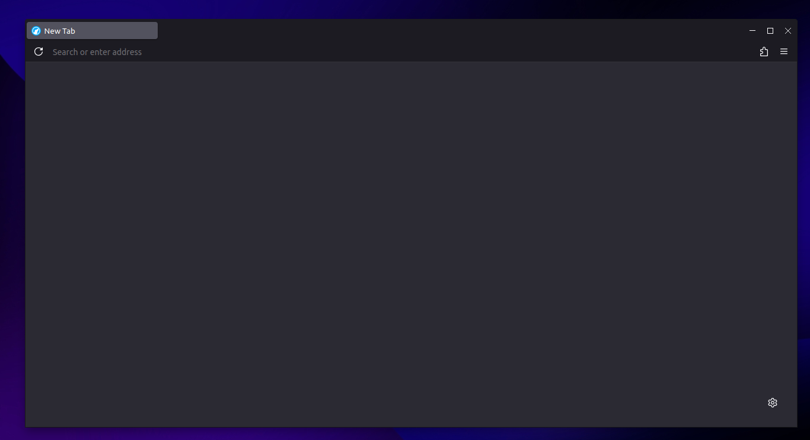

# userChrome.css
My custom userChrome.css and userContent.css for Firefox. Based on [Eric Murphy's userChrome](https://github.com/ericmurphyxyz/userChrome.css) (which is based on [Darknight](https://github.com/BriLHR/FirefoxCSS-Darknight), which is based on [keyfox](https://github.com/alfaaarex/keyfox)) with some extra tweaks.

# Installation
1. Enable `toolkit.legacyUserProfileCustomizations.stylesheets` from `about:config`.
2. Open your profile directory (see about:profiles) and create a directory called `chrome`.
3. Add the `userChrome.css` and `userContent.css` to your chrome folder.
